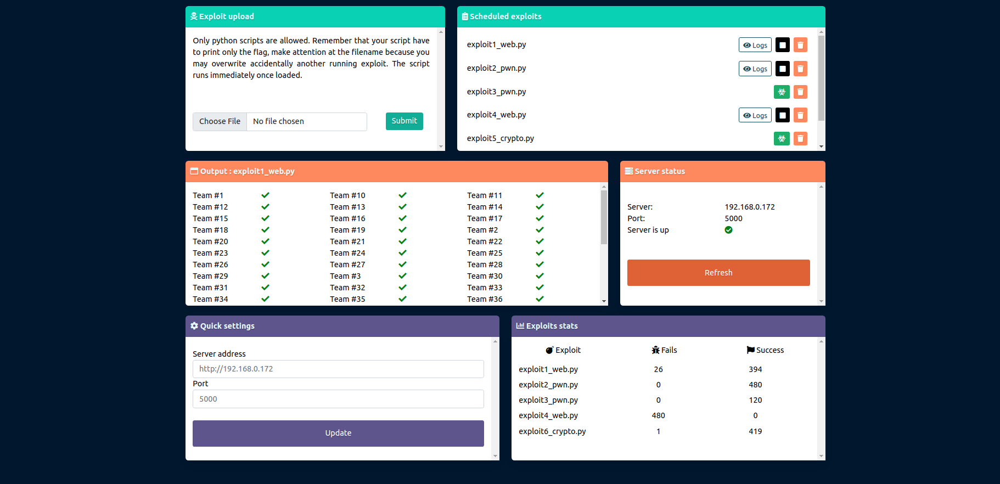

# Str4ngeBust3r


Graphical client for [DestructiveFarm](https://github.com/Str4ngeb0yz/DestructiveFarm)

## Docker

Run in `docker` with:

```bash
git clone https://github.com/Str4ngeb0yz/Str4ngeBust3r.git
cd ./Str4ngeBust3r
docker build -t st4ngebust3r .
docker run -p 5000:5000 -d st4ngebust3r
```

Visit <http://0.0.0.0:5000/>